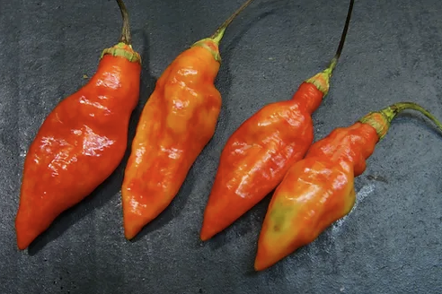

## **Adrenalina**
  - [Description](#description)
  - [Planting Information](#planting-information)
  - [Companion planting](#companion-planting)
  - [Seed information](#seed-information)

---

### Description

**Adrenalina** The Adrenalina Red Pepper originates Italy and is a cross between Red Shark and 7 Pot Bubblegum Red. Fruits can get to 3.5 inch long and turns from green to red/black when fully ripe. Plants can get to 48+ inches tall but often times they stay around 36 inches tall. Pods are hot (Scoville units: 100,000 to  200,000 SHU) and have a really nice fruity smell. 

### Planting Information

### Location

- Full sun, or at least 6-8 hours of sun per day
- Well-drained soil

### Soil preparation

- **Soil should have abundant phosphorus and calcium**, so add lime and compost to the bed at least three weeks prior to transplanting

### Timing 

- Transplant peppers outside in spring after the last risk of frost has passed
- Ensure that overnight temperatures are consistently over 10°C before planting
- [Harden off](hardening_off.md) seedlings before planting

#### Spacing 

- 30-60cm (12-24″) between plants

### Planting

- Dig a hole larger than the root ball of your pepper. Ensure that it is deep enough, so that when the pepper is planted, the soil is level with the transplant's [cotyledon leaves](images/pepper_cotyledons.png) (the lowest set of leaves)
- Mix ½ cup of balanced organic fertilizer or compost into the hole
- Gently remove the pepper from its container and loosen the soil and roots
- Place into the hole and fill the soil in around the plant
- Gently pack down the soil and add more if needed
- Water immediately after planting
- Spread mulch around the plants to help keep the soil cool and moist.
- Support each pepper plant with a stake or small tomato cage, to help bear the weight of the fruit once it begins to produce.

### Watering

- Water regularly throughout the season. Aim for a total of 1-2 inches per week (more when it's hotter).
- Peppers will tolerate dry soil, they will only put on good growth if kept moist.

### Harvesting

- When the fruit is large and firm it is ready to pick. Or wait for the fruit to ripen further brown. The sweetness and vitamin C content go up dramatically as the fruit changes colour. If you pick green, the total numbers of peppers harvested will increase. Fruit that sets after late August will not usually develop or ripen. Pull out the entire bush just before the first frost and hang it upside down in a warm, dry place to ripen hot peppers. 

### Care

- [Pinch back growing tips](pinching_pepper_flowers.md) and optionally [top the plants](topping_pepper_plants.md) to encourage leaf production
- In case of unexpected frost, water, then cover plant with a frost cloth or a deep layer of mulch
- Replenish fertilizer or compost throughout the season
- Don't over-fertilize your pepper plants with Nitrogen, especially later in the season, as too much nitrogen will result in a bushy plant without blossoms or fruit.

### Companion planting

**Friends**

  1. alliums
  2. asparagus
  3. basil
  4. carrots
  5. cucumbers
  6. eggplant
  7. endive
  8. marjoram
  9. Marigold
  10. Nasturtium
  11. oregano
  12. parsley
  13. rosemary
  14. spinach
  15. squash
  16. Swiss chard
  17. tomatoes

**Foes**

   1. beans
   2. broccoli
   3. Brussels sprouts
   4. cabbage
   5. cauliflower
   6. fennel
   7. kale
   8. radishes
   9. turnips

### Seed information

[Scoville Canada](https://scovillecanada.com/)
