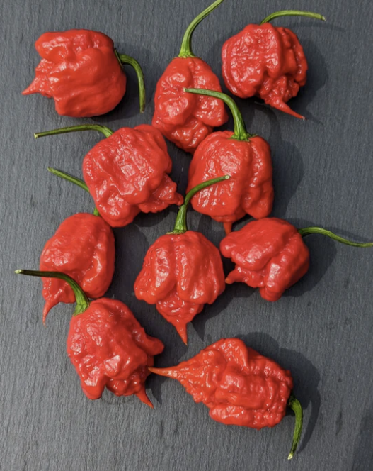

## **Carolina Reaper**
  - [Description](#description)
  - [Planting Information](#planting-information)
  - [Companion planting](#companion-planting)
  - [Seed information](#seed-information)

---

### Description

**Carolina Reaper** is officially the hottest pepper on record, at 1,500,000 SHU, and has peaked at 2,200,000 SHU. The smallish peppers mature from green to fire engine red, and are gnarled and bumpy with a distinctive pointed tip some growers call "the stinger." The Carolina Reaper has a sweet and fruity flavor with unrelenting, extreme heat. This species of pepper can be grown as a perennial in warmer climates (or heated greenhouses), or brought inside over winter. They are somewhat challenging to grow. Please take extreme caution when handling the seeds and eventual fruits they produce. 

### Planting Information

#### Spacing 

30-60cm (12-24″) between plants

### Location

- Full sun, or at least 6-8 hours of sun per day
- Well-drained soil

### Watering

  - Water immediately after planting, then regularly throughout the season. Aim for a total of 1-2 inches per week (more when it's hotter).

### Harvesting

When the fruit is large and firm it is ready to pick. Or wait for the fruit to ripen further turning red. The sweetness and vitamin C content go up dramatically as the fruit changes colour. If you pick green, the total numbers of peppers harvested will increase. Fruit that sets after late August will not usually develop or ripen. Pull out the entire bush just before the first frost and hang it upside down in a warm, dry place to ripen hot peppers. 

### Notes

- **Soil should have abundant phosphorus and calcium**, so add lime and compost to the bed at least three weeks prior to transplanting
- Mix ½ cup of balanced organic fertilizer beneath each plant. 
    - Replenish throughout the season
- Spread mulch around the plants to help keep the soil cool and moist.
- Peppers will tolerate dry soil, they will only put on good growth if kept moist.
- [Harden off](hardening_off.md) seedlings before planting
- [Pinch back growing tips](pinching_pepper_flowers.md) to encourage leaf production
- Support each pepper plant with a stake or small tomato cage, to help bear the weight of the fruit once it begins to produce.

### Companion planting

**Friends**

  1. alliums
  2. asparagus
  3. basil
  4. carrots
  5. cucumbers
  6. eggplant
  7. endive
  8. marjoram
  9. Marigold
  10. Nasturtium
  11. oregano
  12. parsley
  13. rosemary
  14. spinach
  15. squash
  16. Swiss chard
  17. tomatoes

**Foes**

   1. beans
   2. broccoli
   3. Brussels sprouts
   4. cabbage
   5. cauliflower
   6. fennel
   7. kale
   8. radishes
   9. turnips

### Seed information

[Scoville Canada](https://scovillecanada.com/products/t-rex-mustard)
