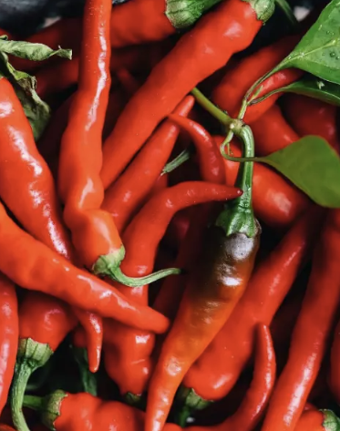

## **Cayenne**
  - [Description](#description)
  - [Planting Information](#planting-information)
  - [Companion planting](#companion-planting)
  - [Seed information](#seed-information)

---

### Description

The **cayenne** is a popular hot chilli pepper. Long up to 6” and skinny up to ½” at the shoulder. An upright, bushy plant that is highly productive. Reaches up to 2’ in height. The plant produces straight emerald green peppers that mature into a wrinkled bright red fruit. 30,000-50,000 SHU.

### Planting Information

#### Spacing 

30-60cm (12-24″) between plants

### Location

- Full sun, or at least 6-8 hours of sun per day
- Well-drained soil

### Watering

  - Water immediately after planting, then regularly throughout the season. Aim for a total of 1-2 inches per week (more when it's hotter).

#### Notes

- **Soil should have abundant phosphorus and calcium**, so add lime and compost to the bed at least three weeks prior to transplanting
- Mix ½ cup of balanced organic fertilizer beneath each plant. 
  - Replenish throughout the season
- Spread mulch (such as chopped leaves or straw) around the plants to help keep the soil cool and moist.
- Peppers will tolerate dry soil, they will only put on good growth if kept moist.
- Harden off seedlings before planting
- Pinch back growing tips to encourage leaf production
- Support each pepper plant with a stake or small tomato cage, to help bear the weight of the fruit once it begins to produce.

### Companion planting

**Friends**

  1. alliums
  2. asparagus
  3. basil
  4. carrots
  5. cucumbers
  6. eggplant
  7. endive
  8. marjoram
  9. Marigold
  10. Nasturtium
  11. oregano
  12. parsley
  13. rosemary
  14. spinach
  15. squash
  16. Swiss chard
  17. tomatoes

**Foes**

   1. beans
   2. broccoli
   3. Brussels sprouts
   4. cabbage
   5. cauliflower
   6. fennel
   7. kale
   8. radishes
   9. turnips

### Seed information

[Gaia Organic Seeds](https://gaiaorganics.ca/product/cayenne-hot-pepper/)
