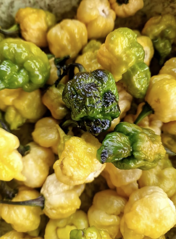

## **Da Hulk**
  - [Description](#description)
  - [Planting Information](#planting-information)
  - [Companion planting](#companion-planting)
  - [Seed information](#seed-information)

---

### Description

**Da Hulk** pods begin their journey as a striking dark black, adorned with vibrant green patches. As they progress towards maturity, they transition into a deep, enchanting green, and ultimately culminate in a visually intriguing cream-yellow hue. It's important to note that while this colour transformation may hint at some level of instability in the variety, it undoubtedly makes for an exceptionally fascinating and rewarding grow. Foliage is dark purple with black stems. The Da Hulk pepper doesn't just captivate with its visual appeal; it also packs a punch in the heat department. Boasting a fiery temperament, it's sure to satisfy the cravings of even the most ardent spice enthusiasts. To complement its potent heat, the Da Hulk pepper emits a delightful floral scent that adds an extra layer of sensory delight to your culinary creations.

### Planting Information

#### Spacing 

30-60cm (12-24″) between plants

### Location

- Full sun, or at least 6-8 hours of sun per day
- Well-drained soil

### Watering

  - Water immediately after planting, then regularly throughout the season. Aim for a total of 1-2 inches per week (more when it's hotter).

#### Notes

- **Soil should have abundant phosphorus and calcium**, so add lime and compost to the bed at least three weeks prior to transplanting
- Mix ½ cup of balanced organic fertilizer beneath each plant. 
  - Replenish throughout the season
- Spread mulch (such as chopped leaves or straw) around the plants to help keep the soil cool and moist.
- Peppers will tolerate dry soil, they will only put on good growth if kept moist.
- Harden off seedlings before planting
- Pinch back growing tips to encourage leaf production
- Support each pepper plant with a stake or small tomato cage, to help bear the weight of the fruit once it begins to produce.

### Companion planting

**Friends**

  1. alliums
  2. asparagus
  3. basil
  4. carrots
  5. cucumbers
  6. eggplant
  7. endive
  8. marjoram
  9. Marigold
  10. Nasturtium
  11. oregano
  12. parsley
  13. rosemary
  14. spinach
  15. squash
  16. Swiss chard
  17. tomatoes
**Foes**

   1. beans
   2. broccoli
   3. Brussels sprouts
   4. cabbage
   5. cauliflower
   6. fennel
   7. kale
   8. radishes
   9. turnips

### Seed information

[Scoville Canada](https://scovillecanada.com/)
