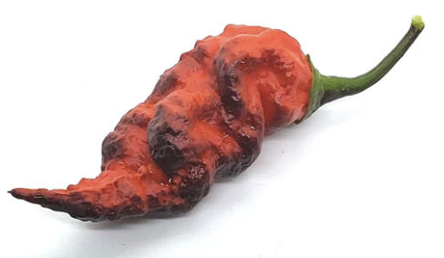

## **Naga Tiger DD**
  - [Description](#description)
  - [Planting Information](#planting-information)
    - [Spacing](#spacing)
    - [Notes](#notes)
  - [Companion planting](#companion-planting)
  - [Seed information](#seed-information)

---

### Description

The **Naga Tiger DD** is a stunning and beautiful pepper.  Pods ripen to a deep red with black mottling.  Heat is near Ghost pepper level.  

### Planting Information

#### Spacing 

30-60cm (12-24″) between plants

### Location

- Full sun, or at least 6-8 hours of sun per day
- Well-drained soil

### Watering

  - Water immediately after planting, then regularly throughout the season. Aim for a total of 1-2 inches per week (more when it's hotter).

#### Notes

- **Soil should have abundant phosphorus and calcium**, so add lime and compost to the bed at least three weeks prior to transplanting
- Mix ½ cup of balanced organic fertilizer beneath each plant. 
  - Replenish throughout the season
- Spread mulch (such as chopped leaves or straw) around the plants to help keep the soil cool and moist.
- Peppers will tolerate dry soil, they will only put on good growth if kept moist.
- Harden off seedlings before planting
- Pinch back growing tips to encourage leaf production
- Support each pepper plant with a stake or small tomato cage, to help bear the weight of the fruit once it begins to produce.

### Companion planting

**Friends**

   1. asparagus
   2. basil
   3. carrots
   4. cucumbers
   5. eggplant
   6. endive
   7. oregano
   8. parsley
   9. rosemary
   10. squash
   11. Swiss chard
   12. tomatoes

**Foes**

   1. beans
   2. broccoli
   3. Brussels sprouts
   4. cabbage
   5. cauliflower
   6. fennel
   7. kale
   8. radishes
   9. turnips

### Seed information

[Scoville Canada](https://scovillecanada.com/)
