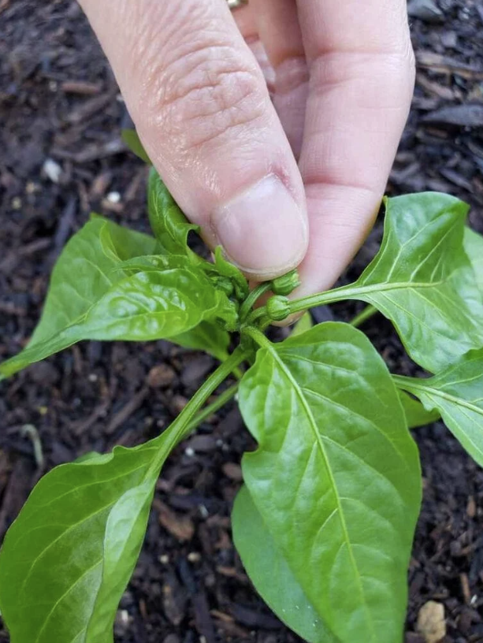

## Pinching Pepper Flowers

While it may seem counterintuitive, pinching off early pepper flowers is another way to encourage larger, more productive pepper plants. Rather than focusing all of its energy on growing fruit right away, removing the first few flower buds will redirect the young plant to continue to grow bigger in size first – so it can produce more peppers later in life! 

To pinch pepper flowers, simply use your fingers or small pruners to gently remove the first round of flower buds that the plant produces – especially when the plant is still small (about 8 inches tall or less). I do this for small chili peppers and larger bell peppers alike. You can remove all the earliest flower buds, or only some of them. Either way, it will help the pepper plant grow.

[Source](https://homesteadandchill.com/topping-pepper-plants/#:~:text=Topping%20Pepper%20Plants%3A%20When%20and%20How&text=We%20usually%20top%20our%20pepper,my%20favorite%20small%20pruning%20snips.)