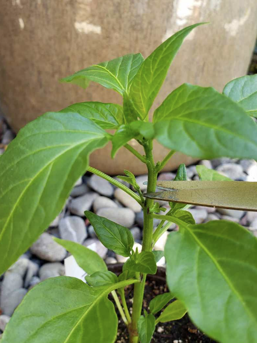
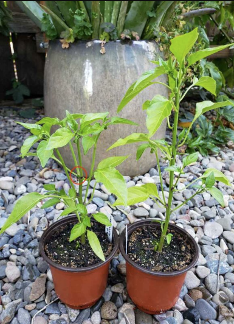

## Topping Pepper Plants

### What varieties of peppers should be topped?

**Topping pepper plants is typically recommended for pepper varieties that produce small fruit**. For instance, jalapeños, Thai chilis, serranos, cayenne, shishitos, habaneros (I prefer habanda), or other petite chili peppers. Chili peppers generally grow fairly bushy on their own; topping them simply pushes them to do so sooner and even more!

On the other hand, **topping bell pepper plants may have a negative impact on growth and fruit development**. This applies to any large, thick-walled pepper varieties. Topping bell peppers is rumored to potentially stunt the plants or reduce the number of fruit they produce (and they already produce far fewer fruit in general). So when in doubt, leave those big ones un-topped. Or, do an experiment! Top some bell peppers, leave the others au natural, and compare how they perform.

For **medium-size fruit** like banana or poblano peppers, you could go either way – top them or not. 

### Topping Pepper Plants: When and How

Top pepper plants when the seedlings are at least 5 to 6 inches tall. On the other hand, don’t wait too long to top your peppers or it can stunt their growth. We usually top our pepper seedlings about a month after they germinate, before transplanting them outside.

Simply trim or pinch off the very tip of the main stem (an inch or so), right above an upper set of leaves. I like to use my favorite small pruning snips. See the photos below. Be sure your pruners or scissors are clean to prevent spread of disease!

When topping pepper seedlings, it’s important to always leave behind several leaves on the plant. New branches will grow from the main stem at the nodes just above each leaf. Plus, the plant needs plenty of leaves to continue to photosynthesize and grow! 

Trim the very tip of the main stem (an inch or so) right above an upper set of leaves

---

After pruning

---

The same topped cayenne pepper seedling about 2 weeks later (left), with the same variety un-topped on the right. The red circle shows where the stem was topped

[Source](https://homesteadandchill.com/topping-pepper-plants/)